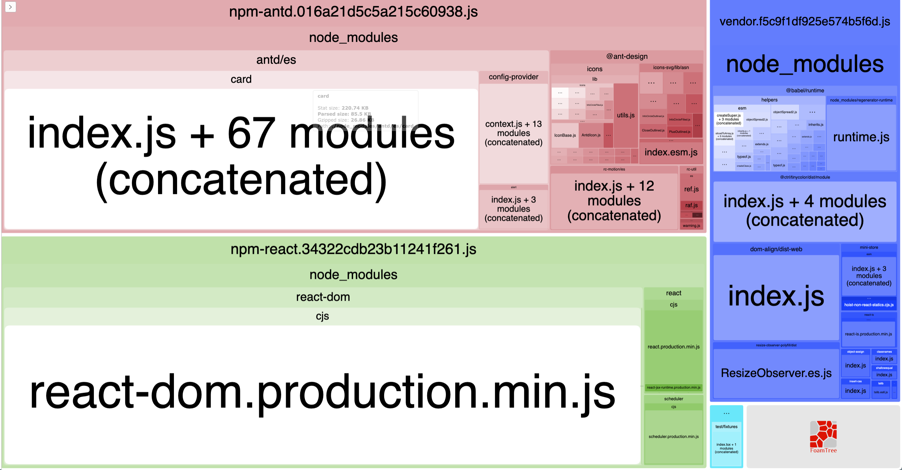

[](https://www.npmjs.com/package/ts-import-plugin)
[](https://circleci.com/gh/Brooooooklyn/ts-import-plugin)
[](https://coveralls.io/github/Brooooooklyn/ts-import-plugin)

# ts-import-plugin

[](https://greenkeeper.io/)

Modular import plugin for TypeScript, compatible with antd, antd-mobile and so on.

webpack template `./webpack.config.js`, run: `npm start` to see the bundle analyzer.

> This plugin is not work if your are using `import * as _ from 'lodash'` or `import _ from 'lodash'`



# Why use this

transform such code:
```ts
import { Alert, Card as C } from 'antd'
```
into:

```ts
import Alert from 'antd/lib/alert'
import 'antd/lib/alert/style/index.less'
import { default as C } from 'antd/lib/card'
import 'antd/lib/card/style/index.less'
```

# Usage

## With ts-loader
```js
//tsconfig.json
{
  ...
  "module": "ESNext",
  ...
}
```

```js
// webpack.config.js
const tsImportPluginFactory = require('ts-import-plugin')

module.exports = {
  // ...
  module: {
    rules: [
      {
        test: /\.(jsx|tsx|js|ts)$/,
        loader: 'ts-loader',
        options: {
          transpileOnly: true,
          getCustomTransformers: () => ({
            before: [ tsImportPluginFactory( /** options */) ]
          }),
          compilerOptions: {
            module: 'es2015'
          }
        },
        exclude: /node_modules/
      }
    ]
  },
  // ...
}
```

## With awesome-typescript-loader ( >= 3.5.0 )
```js
//tsconfig.json
{
  ...
  "module": "ESNext",
  ...
}
```

```js
// webpack.config.js
const tsImportPluginFactory = require('ts-import-plugin')

module.exports = {
  // ...
  module: {
    rules: [
      {
        {
        test: /\.tsx?$/,
        loader: 'awesome-typescript-loader',
        options: {
          getCustomTransformers: () => ({
            before: [ tsImportPluginFactory( /** options */) ]
          }),
        },
        exclude: /node_modules/
      }
    ]
  },
  // ...
}
```
## Options

`options` can be an object:

- libraryName `string`

  default `'antd'`
- style `boolean | string | ((path: string) => string)`

  default `false`
- libraryDirectory `string | ((name: string) => string)` 

  default `'lib'`
- camel2DashComponentName `boolean`

  default `true`
- camel2UnderlineComponentName `boolean`

  default `false`

example:

```js
tsImportPluginFactory({
  libraryName: 'antd',
  libraryDirectory: 'lib',
  style: true
})
```

```js
{
  libraryName: 'material-ui',
  libraryDirectory: '',
  camel2DashComponentName: false
}
```

`options` can be an array:

example:

```javascript
[
  {
    libraryName: 'antd',
    libraryDirectory: 'lib',
    style: true
  }, {
    libraryName: 'material-ui',
    libraryDirectory: '',
    camel2DashComponentName: false
  }
]
```

# Compatible libs:

## [ant-design](https://github.com/ant-design/ant-design)

```ts
const transformerFactory = require('ts-import-plugin')
// with less
transformerFactory({ style: true })
// with css
transformerFactory({ style: 'css' })
// without style
transformerFactory()
```

## [lodash](https://github.com/lodash/lodash/)

> notice you should manual `import 'lodash/core'` in your project if your are using `import { chain } from 'lodash'` .

```ts
transformerFactory({
  style: false,
  libraryName: 'lodash',
  libraryDirectory: null,
  camel2DashComponentName: false
})
```

## [antd-mobile](https://github.com/ant-design/ant-design-mobile)

```ts
// with css.web
transformerFactory({ libraryName: 'antd-mobile', style: 'css', styleExt: 'css.web' })

// antd-mobile recently changed styleExt. If error occurs with prev, try next.
transformerFactory({ libraryName: 'antd-mobile', style: 'css' })
```

## [material-ui](https://github.com/callemall/material-ui)

```ts
import { FloatingActionButton } from 'material-ui'
import { ContentRemove, NavigationRefresh, ContentAdd } from 'material-ui/svg-icons'
```

```ts
transformerFactory({
  libraryName: 'material-ui',
  libraryDirectory: '',
  camel2DashComponentName: false
})

// svg-icons
transformerFactory({
  libraryDirectory: importName => {
    const stringVec = importName.split(/([A-Z][a-z]+|[0-9]*)/)
      .filter(s => s.length)
      .map(s => s.toLocaleLowerCase())

    return stringVec
      .reduce((acc, cur, index) => {
        if (index > 1) {
          return acc + '-' + cur
        } else if (index === 1) {
          return acc + '/' + cur
        }
        return acc + cur
      }, '')
  },
  libraryName: 'material-ui/svg-icons',
  style: false,
  camel2DashComponentName: false
})
```

## [RxJS](https://github.com/reactivex/rxjs)

see [rxjs-webpack-treeshaking-example](https://github.com/Brooooooklyn/rxjs-webpack-treeshaking-example) for more details

> only compatible for 5.5+

- RxJS v5:

```ts
transformerFactory({
  libraryDirectory: '../_esm2015/operators',
  libraryName: 'rxjs/operators',
  style: false,
  camel2DashComponentName: false,
  transformToDefaultImport: false
})
```

- RxJS v6:

```ts
transformerFactory([
  {
    libraryDirectory: '../_esm5/internal/operators',
    libraryName: 'rxjs/operators',
    camel2DashComponentName: false,
    transformToDefaultImport: false
  },
  {
    libraryDirectory: '../_esm5/internal/observable',
    libraryName: 'rxjs',
    camel2DashComponentName: false,
    transformToDefaultImport: false,
  }
])
```
